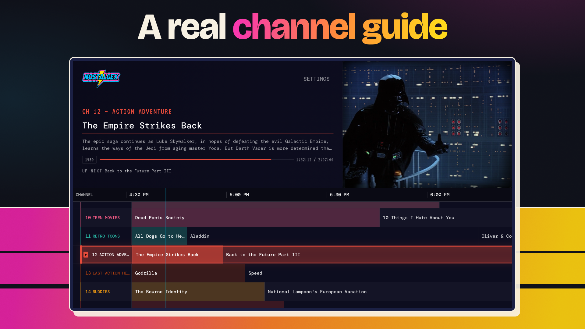

# Nostalgex

A free, open source retro TV channel guide for your own Plex, Jellyfin or Emby server.

[](LICENSE)
[](https://discord.gg/FgnZcr5bDT)



Nostalgex turns your library into 131 channels in 14 bundles, with a real channel guide. Channels fill themselves from your library based on rules (genre, studio, watch history, content ratings and more) and play on a fixed daily schedule, so tuning in feels like live TV. It's a client only. It doesn't host or supply any media.

## Get it

- **Apple TV:** [Nostalgex on the App Store](https://apps.apple.com/app/nostalgex/id6762563534). Free, tvOS 18 or later.
- **Any browser:** [the web tuner](https://www.nostalgex.app/web-tuner). Free, nothing to install.
- **Website:** [nostalgex.app](https://www.nostalgex.app)

No ads, no account, no in-app purchases.

## Works with

- **Plex**
- **Jellyfin**
- **Emby** (on the web tuner, Emby connects through the Jellyfin option)

The Apple TV app can connect to more than one server at a time.

**Source of truth:** this repository (`chadMueller/Nostalgex`) contains the **public site**, **web tuner**, and **tvOS app** together. Read **[docs/REPOSITORY-LAYOUT.md](docs/REPOSITORY-LAYOUT.md)** for boundaries, deploy split, and how to avoid duplicating Nostalgex inside unrelated monorepos.

## Maintained

Nostalgex has been on the App Store since April 19, 2026, and gets updates every month. I'm one person, and I read every issue.

Recent evidence, so you don't have to take my word for it:

- **Releases:** 1.0.23 shipped to the App Store this week, and 1.0.24 is in the repo now. Full history is in the [App Store version history](https://apps.apple.com/app/nostalgex/id6762563534) and [`content/changelog.json`](content/changelog.json).
- **Dev log:** [docs/DEVLOG.md](docs/DEVLOG.md) explains why things changed and what's still half done.
- **Issues and outside PRs:** on Oct 8, 2026 I merged [#5](https://github.com/chadMueller/Nostalgex/pull/5) and [#7](https://github.com/chadMueller/Nostalgex/pull/7) from [@Gorbataras](https://github.com/Gorbataras) (Emby seek fix, and no more sound over a black picture on Jellyfin and Emby), and closed [#3](https://github.com/chadMueller/Nostalgex/issues/3), the wrong-start-time bug. #7 went from opened to merged in about two hours.
- **Tests** run in CI on every push to `main` and on every pull request.

## Apps

### Web tuner (`web-tuner.html` + `plex-tuner.html`)
Browser app. `web-tuner.html` (routed as `/web-tuner`) is the connect screen; after sign-in it navigates to `plex-tuner.html`, which is the tuner itself: channel guide, surfing, playback.

- **Stack:** Vanilla HTML/JS, Vite, Vercel
- **Backends:** Plex, plus Jellyfin and Emby (Emby connects through the Jellyfin option).

**Browser limitation, by design of the web, not ours:** the tuner is served over HTTPS, so browsers block mixed content and it cannot reach a server on plain `http://` or on a raw LAN IP. Plex works because plex.direct issues real certificates for local addresses. Jellyfin and Emby need an HTTPS URL with a valid certificate (reverse proxy or tunnel). A local-only server with no HTTPS is reachable from the Apple TV app but not from the browser.

### tvOS (`Nostalgex/`)
Native Apple TV app, free on the App Store, open source. Same channel logic and config, built for the big screen with Siri Remote navigation. Connects to Plex, Jellyfin, and Emby, including more than one server at a time. No mixed-content limitation here -- a plain-http local server works fine.

- **Stack:** SwiftUI, AVPlayer, Xcode 26+
- **Target:** tvOS 18+
- **Key files:**
  - `App/AppState.swift` -- playback engine, channel selection, filtering
  - `Models/ChannelSchedule.swift` -- deterministic daily schedule builder
  - `Models/Channel.swift` -- channel config and rules
  - `Services/MediaBackend.swift` -- the backend protocol the three servers implement
  - `Services/PlexAPIService.swift`, `Services/JellyfinAPIService.swift`, `Services/EmbyAPIService.swift` -- server clients
  - `Views/` -- TunerView, PlayerView, ChannelGuideView, etc.
 
### Public site (`index.html`)
Marketing page and the path into the tuner and the App Store. Served at `/` on Vercel.

## Shared Config

### `channels.json`
Both apps read the same channel configuration (131 channels in 14 bundles). The tvOS app bundles a copy and can also fetch an updated one at runtime.

See `CHANNELS.md` for a human-readable breakdown of each channel's rules and behavior.

### Schedule Logic
Both apps use a deterministic daily-seeded shuffle. The item pool for each channel is shuffled once per day (seeded by date + channel ID), then laid out end-to-end in a loop. The current position in the loop is derived from unix time, so tuning in at 2:15 PM always lands at the same spot in the schedule for that day.

When a video ends naturally on tvOS, the next video starts from the beginning (no mid-stream seek on auto-advance). On initial tune-in, you join mid-stream like real TV.

**The two schedules have diverged.** tvOS adds premiere priority, sequel adjacency, prime-time premieres for new additions, and a 6-hour refresh. The web tuner has none of those, so the same server on the same day will not show the same lineup in both places.

## Channel Rules

Channels filter your library (Plex, Jellyfin, or Emby, normalised to one internal model) using combinations of:
- **type** -- movie or episode
- **genres** -- include, exclude, requireAll
- **studios** -- Disney, HBO, etc.
- **yearRange** -- min/max year
- **contentRatings** -- whitelist (TV-Y, PG, R, etc.)
- **durationRange** -- min/max minutes
- **watchedOnly / unwatchedOnly / rewatched** -- watch history filters
- **timeRestrictions** -- block mature content before a set hour

## Development

### Web
```
npm install
npm run dev
```

### tvOS
Open `Nostalgex/Nostalgex.xcodeproj` in Xcode. Build target is Nostalgex (tvOS).

To run on a physical Apple TV: Xcode > Window > Devices and Simulators > pair your Apple TV, then select it as the run destination.

### Debug Logging (tvOS)
All playback logs are prefixed with `[Plex90]`. Filter the Xcode console to see channel selection, item loading, AVPlayer status changes, retries, and auto-advance events.

## Build it yourself (tvOS)

You need Xcode 26 or newer and an Apple TV or the tvOS simulator. Open `Nostalgex/Nostalgex.xcodeproj`, pick your own team under Signing, and run the `Nostalgex` scheme. No API keys are required. The app connects to your server, builds channels from your library's own metadata, and plays.

Two optional extras, both off unless you turn them on:

| What | How to enable | What it adds |
|---|---|---|
| TMDB / OMDb / Supabase metadata | Set `TMDB_API_KEY`, `OMDB_API_KEY`, `SUPABASE_URL`, `SUPABASE_ANON_KEY` as environment variables in the Xcode scheme, or as `TMDBApiKey`, `OMDBApiKey`, `SupabaseURL`, `SupabaseAnonKey` in `Nostalgex/Info.plist`. Read in `Services/TMDBConfig.swift`. | Keyword and collection data for finer channel rules. Supabase is a cache keyed on TMDB ids; you can point it at your own project. |
| TelemetryDeck | `TelemetryDeckAppID` in `Nostalgex/Info.plist`. Delete the key to turn it off. | Anonymous launch and playback counts. The App Store build has it on; your own build does not have to. |

Never commit real keys. `.gitignore` already covers `.env`, `Secrets.plist` and `*.xcconfig` secrets.

## What leaves your network

The whole point of running your own server is knowing where your data goes, so here is the full list for the tvOS app:

- **Your media server.** Direct from the Apple TV to your Plex, Jellyfin or Emby. Sign-in goes straight to the server. Nothing of mine sits in between, and no credentials are ever sent anywhere else.
- **plex.tv** (Plex only). The PIN sign-in flow and server discovery. This is how every Plex client works.
- **MusicBrainz.** Public metadata for the music video channels. No key, no account.
- **TMDB, OMDb, Supabase.** Only if you build with keys, see above.
- **TelemetryDeck.** Anonymous usage signals in the App Store build. No identifiers, no library contents, no server addresses. Off in your own build unless you keep the key.

The website and web tuner at nostalgex.app load one page analytics script (statsngraphs). The privacy policy at `/privacy` covers all of this in plain language.

## Community and support

- **Discord:** [join the server](https://discord.gg/FgnZcr5bDT) to ask questions, share your lineup, or hear about updates first.
- **Bugs and feature requests:** [GitHub Issues](https://github.com/chadMueller/Nostalgex/issues). Include your server (Plex, Jellyfin or Emby), its version, and your Apple TV model.
- **Email:** support@nostalgex.app
- **Help pages:** [support](https://www.nostalgex.app/support) and [docs/FAQ.md](docs/FAQ.md).

## Support the project

Nostalgex is free and it's staying free. If it gives you a good Friday night, you can [buy me a coffee](https://buymeacoffee.com/chadmueller). It covers the Apple developer fee and keeps updates coming. The Sponsor button at the top of this repo goes to the same place.

Helping costs nothing too: star the repo, rate the app on the App Store, or tell me about a channel that's always empty.

## Contributing

Issues and pull requests are welcome. A few things that make them land faster:

- The easiest first PR is a rule change in `channels.json` (a title on the wrong channel, a channel that is always empty). `CHANNELS.md` explains every rule field.
- Keep PRs small and about one thing.
- Web changes: `npm test` must pass. tvOS changes: build for a real Apple TV, not just the simulator, because the simulator keychain and storage behave differently.
- Not sure where to start? Ask in [Discord](https://discord.gg/FgnZcr5bDT) or open an issue first.
- One person maintains this in their spare time. You will get a reply, but not always the same day.

## License

MIT, see `LICENSE`. Bundled fonts and packages are listed in `THIRD-PARTY-LICENSES.md`.

The Nostalgex name, icon and the nostalgex.app site are not part of the MIT grant. Fork the code all you like, but please ship it under your own name.

## Deployment

Web app deploys to Vercel automatically on push to `main`.

